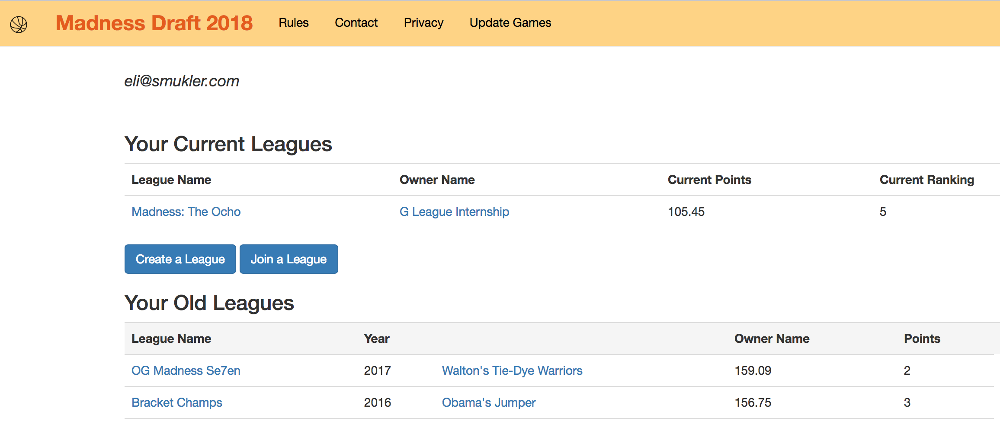

# Madness Draft 2018

A Fantasy Draft game for the NCAA Men's Basketball Tournament.

- Ruby on Rails app built with React.js frontend, hosted on Heroku.
- Updates with live scores using a Ruby web scraper.
- Point total calculations based on historical win probabilities of each seed thanks to [@ryanvmenezes](https://github.com/ryanvmenezes).

Having issues? Email [Madness Draft](mailto:draftmadnessgame@gmail.com).

## Screenshots

### User Profile

### Draft Results

### Standings

### Team Page

